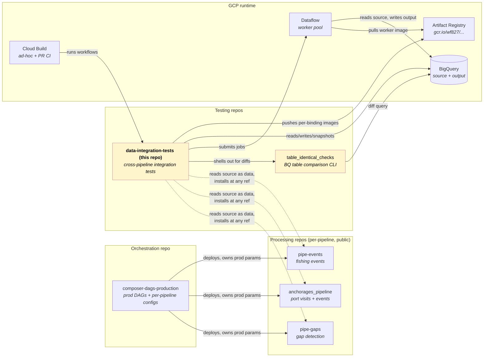
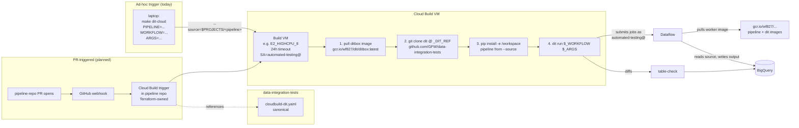

# dit architecture

Visual reference for how the pieces fit together. Five diagrams (Mermaid + ASCII), each tackling a different angle. Designed to be read top-to-bottom for a new joiner; each section is self-contained for revisits.

Other reference material:
- [`plan.md`](plan.md) — implementation plan + phase status
- [`conventions.md`](conventions.md) — naming, image namespace, prod-infra boundary
- [`pipeline-contract.md`](pipeline-contract.md) — what a pipeline must expose to be cleanly testable
- [`framework-vision.md`](framework-vision.md) — long-term shape (don't optimise for it yet)

---

## 1. System context — repos, what each owns

GFW data pipelines are split across three repo flavours; dit is one of them. The comparison engine (`table_identical_checks`) lives in its own repo and is consumed by dit as a subprocess.



**Ownership boundaries.**

| Owns | Repo |
|---|---|
| Pipeline source code (Beam PTransforms, DoFns) | Processing repos |
| Production params (DAG schedules, config values, IAM) | `composer-dags-production` |
| Integration-test workflows + dit framework | `data-integration-tests` (this repo) |
| BQ table comparison engine | `table_identical_checks` |
| Production deployments | `composer-dags-production` operators |

**Rule**: dit treats `composer-dags-production` as **data**, not code (no `import gfw.…`); reads prod params via a planned `dit sync-params` step. dit treats pipeline repos as **packages**, installable at any ref via `make install-<pipeline>-ref`.

---

## 2. Run modes — how dit gets invoked

| Mode | Trigger | Use case | Wall clock | Status |
|---|---|---|---|---|
| **Ad-hoc, laptop** | `dit run workflows/<pipeline>/<workflow>.py` | Bugfix verification, dev iteration, small cohorts | 5 min – 2 h | ✅ Working |
| **Ad-hoc, Cloud Build** | `make dit-cloud PIPELINE=... WORKFLOW=... ARGS="..."` | Long runs (12 h+); offloads from laptop; reproducible | 30 min – 24 h | 🟡 Image published; smoke run pending |
| **PR-triggered** | GitHub PR opens → Cloud Build trigger in pipeline repo → references `cloudbuild-dit.yaml` | CI: prevent regressions on merge; status check posts to PR | depends on cohort | 📅 Planned |
| **Scheduled** | Cloud Scheduler → Cloud Build (same yaml) | Nightly full-cohort against `main`; Slack on drift | depends on cohort | 📅 Planned |

The same `cloudbuild-dit.yaml` serves the last three modes via substitutions — see § 4.

Two workflow *shapes* (orthogonal to the run modes above):

- **Mode-equivalence** (`workflows/<pipeline>/<name>.py`) — single pipeline version, multiple modes (bf / bfd / bftruncate / mutate_recover) running in parallel, pairwise byte-equivalence check. See § 3.
- **Cross-version** (`workflows/<pipeline>/cross_version_<name>.py`) — multiple pipeline versions (git refs) at single mode, diff to detect intentional or accidental behaviour change. See § 3 (second sequence).

---

## 3. Workflow flows — what actually runs

### 3a. Mode-equivalence (Phase 1 / 2 — verified)

Single pipeline version, exercises that bf / bfd / bftruncate produce equivalent output. The framework's foundational test.

```mermaid
sequenceDiagram
    actor U as User
    participant W as workflows/&lt;pipeline&gt;/mode_equiv.py
    participant DF as Dataflow workers
    participant BQ as BigQuery
    participant TIC as table-check (subprocess)

    U->>W: dit run --runner dataflow --parallel
    W->>W: compute restricted ssvids<br/>(input mutation for mutate_recover)
    par parallel mode submissions
        W->>DF: submit job mode=1_bf
        W->>DF: submit job mode=2_bfd
        W->>DF: submit job mode=3_bftruncate
        W->>DF: submit job mode=4_mutate_recover [pipe-gaps only]
    end
    DF-->>BQ: writes &lt;suffix&gt;_&lt;mode&gt; tables
    DF-->>W: wait_for_job returns (all done)
    loop pairwise diffs
        W->>TIC: table-check summary table_a table_b --keys ...
        TIC->>BQ: full-outer-join + per-column delta query
        BQ-->>TIC: row counts + col deltas
        TIC-->>W: rc=0 if identical
    end
    W-->>U: IDENTICAL / DIFFERENT verdict per pair
```

### 3b. Cross-version (PIPELINE-1465-shaped — landed today)

Multiple pipeline versions against a pinned source snapshot, diff to surface behaviour change. Bindings run in parallel; per-binding `--worker-image` lets each binding exercise different worker code.

```mermaid
sequenceDiagram
    actor U as User
    participant XV as cross_version_ais.py
    participant Git as Git (worktrees)
    participant BQ as BigQuery
    participant DF as Dataflow
    participant AR as gcr.io/wf827/dit/&lt;pipeline&gt;
    participant TIC as table-check

    U->>XV: dit run<br/>--binding before=&lt;ref-A&gt;<br/>--binding after=&lt;ref-B&gt;<br/>--binding-worker-image after=&lt;built-img&gt;
    XV->>BQ: snapshot source @ --pin-source-at
    Note over BQ: dit_exp_&lt;exp-id&gt;_{internal,published}<br/>(7-day TTL)

    par bindings run concurrently (ThreadPoolExecutor)
        XV->>Git: worktree add at ref A
        XV->>DF: ais.py with default worker-image
        and
        XV->>Git: worktree add at ref B
        XV->>DF: ais.py with --worker-image=&lt;built&gt;
    end

    AR-->>DF: workers pull per-binding image
    DF-->>BQ: writes port_visits_&lt;exp&gt;-{before,after}_&lt;mode&gt;
    DF-->>XV: jobs complete (both bindings)

    loop pairwise diffs<br/>(skip pairs where binding failed)
        XV->>TIC: table-check summary
        TIC->>BQ: diff query
        BQ-->>TIC: deltas
    end
    XV-->>U: pairwise verdict (real code differences visible)
```

**Critical detail**: without `--binding-worker-image`, Dataflow workers pull `ais.py`'s default `--worker-image` (a fixed published path). All bindings then run identical worker code — the test becomes a no-op for any change that lives in worker code (most pipeline changes). The override is what makes cross-version *actually* cross-version. See CLAUDE.md plan changelog 2026-05-15 "Cross-version worker-image gap".

---

## 4. Cloud Build runtime

How `make dit-cloud` and the planned PR triggers actually execute. The same `cloudbuild-dit.yaml` is the single source of truth; ad-hoc and PR-triggered paths differ only in *what* invokes Cloud Build.



**Architecture choice** (see CLAUDE.md § Plan changelog 2026-05-15 "Cloud Build architecture decision"):

- **`cloudbuild-dit.yaml` is the single source of truth.** Lives in dit. Every consumer (ad-hoc CLI, per-pipeline triggers, scheduler) routes through it.
- **Per-pipeline triggers are owned by each pipeline repo.** Status checks land in the right repo's UI; teams customize their own triggers without touching dit.
- **Ad-hoc path needs no per-pipeline trigger.** `gcloud builds submit --config=cloudbuild-dit.yaml --source=<pipeline-dir>` works from anywhere. ditbox + the yaml are all that's required.

---

## 5. Image namespace

Where dit-related container images live, vs prod-shaped namespaces in the same project. The boundary is enforced by IAM (the user has `uploadArtifacts` on wf827 only; no `repositories.create` anywhere).

```
us-docker.pkg.dev/world-fishing-827/gcr.io/      (existing AR repo, location: us)
│
├── anchorages_pipeline/         ← prod canonical (read-only for dit)
│   ├── scheduler:<tags>
│   └── worker:<tags>
├── encounters_pipeline/         ← prod canonical (read-only for dit)
├── advanced_fishing_detection/  ← prod canonical (read-only for dit)
├── 4wings/                      ← prod canonical (read-only for dit)
├── ...
│
└── dit/                         ← dit experimental namespace (read/write)
    ├── ditbox:latest, :<short-sha>
    │      └── tooling image: Python + git + gcloud + docker CLI
    │
    ├── pipe-anchorages:<exp-id>-<binding>
    │      └── e.g. pipeline-1465-after
    │      └── per-binding worker image for cross_version_ais.py
    │
    ├── pipe-gaps:<exp-id>-<binding>           (when needed)
    ├── pipe-events:<exp-id>-<binding>         (when needed)
    │
    └── pushtest:<anything>                    (smoke-test only)
```

| Subpath | Tag scheme | Lifecycle |
|---|---|---|
| `dit/ditbox` | `:latest` + `:<short-sha>` | Stable; rebuilt only when ditbox tooling changes |
| `dit/<pipeline>` | `:<experiment-id>-<binding-name>` | Per cross-version experiment; cleanup manual until AR policy lands |
| `dit/pushtest` | `:<anything>` | Smoke-only; delete immediately after use |

Push perms: project-level `uploadArtifacts` on wf827 (the user's group has it). No `repositories.create` needed because everything goes under the pre-existing `gcr.io` repo. See [`conventions.md`](conventions.md) § Image namespace for the build-and-push workflow.

---

## Suggested viewers

These files render best in:

- **GitHub web** — Mermaid auto-renders on github.com/GlobalFishingWatch/data-integration-tests. Zero install. Recommended default.
- **VS Code / Cursor** — install the `Markdown Preview Mermaid Support` extension (free, by Matt Bierner). Then any `.md` preview shows the diagrams.
- **JetBrains IDEs** — Mermaid support is built-in for `.md` previews since 2023.

For drafting new diagrams locally without a renderer, [mermaid.live](https://mermaid.live) is a free hosted editor — paste a fenced block, edit, copy back. No install.
